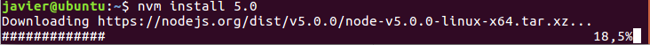
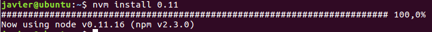
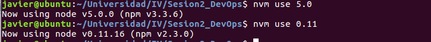
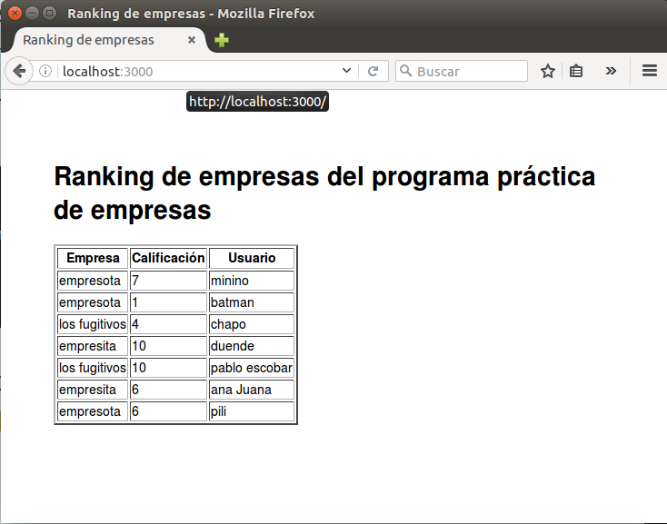
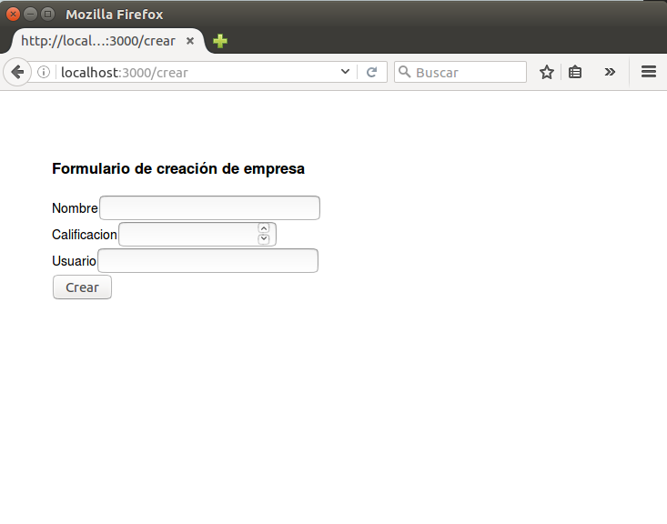
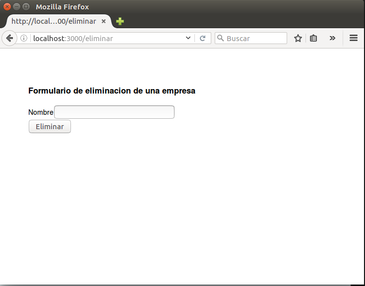
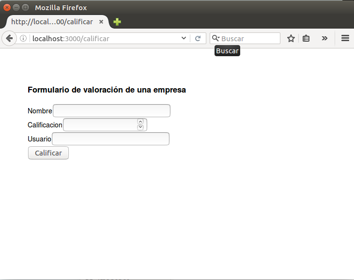
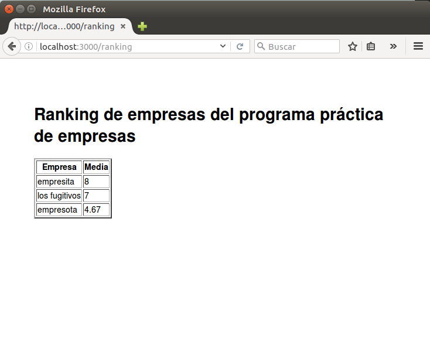
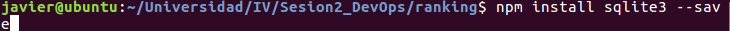

#Sesion 2. Desarrollo basado en pruebas.

En esta sesión empezamos poniendo en marcha un entorno virtual para desarrollo. El entorno elegido es **nvm** que permite variar la versión de *node.js*

Con ella es muy simple conseguir los entornos.

Para poder usar uno simplemente ejecutamos el siguiente comando

###Desarrollo aplicación "Ranking empresas "

Para el desarrollo se ha usado *express-generator* con la que desplegamos la aplicación *node js*. Dicha aplicación se ha usado en diferentes versiones y **solo funcionaba en la v.5.0**.

A continuación se muestran capturas de la aplicación.

Este programa hace uso de **SQLite3** que se instala con **npm install**. Para que se pueda obtener de forma automática a partir de este momento hay que incluir la dependencia de *sqlite3* en el archivo **package.json**

Para ello usamos la orden de instalar pero añadiendo el parámetro *save*

