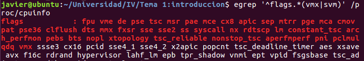
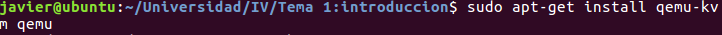

#Ejercicio 1 
Para realizar el cálculo de la amortización de un servidor se ha utilizado:
[precio 10/6/2016](http://www.dynos.es/servidor-hp-proliant-dl385p-gen8-6344-2.6ghz-8gb-ddr3-sff-2u-887758954966__F0B21A.html)
donde el coste con IVA sería de 2205€

1. Amortización 4 años
	Cada año se puede hasta un 25% que sería lo que buscamos entonces sería 2205*.25=

	|      | Amortización(€) |
	|----: | ------------:|
	|Año 1 |      551.25  |
	|Año 2 |      551.25  |
	|Año 3 |      551.25  |
	|Año 4 |      551.25  |

2. Amortización 7 años
	En este caso sería dividir 100 entre 7(número de años) para saber el porcentaje que deseamos amortizar cada año. Por tanto tendremos en torno a 14,3% pero lo redondeamos a 15% que es menor que el máximo y el último solo nos queda el 10%.

	|      | Amortización(€) |
	|----: | ------------:|
	|Año 1 |      330.75  |
	|Año 2 |      330.75  |
	|Año 3 |      330.75  |
	|Año 4 |      330.75  |
	|Año 5 |      330.75  |
	|Año 6 |      330.75  |
	|Año 7 |      220.50  |

#Ejercicio 2 

#Ejercicio 3

1.	Virtualización plena o paravirtualización en caso de querer tener particiones de windows y Linux sobre la misma máquina. También podríamos crear entornos que sean laboratorios y hacer pruebas sobre el como si no fueran virtualizados, y en caso de haber problemas que no afecte al sistema central.

	Otro tipo de virtualización sería virtualización a nivel de sistema operativo donde se podrían crear regiones aisladas de los sistemas operativos pero que no comprometan el sistema anfitrión.

	Finalmente se podría usar la virtualización de entornos de desarrollo para ver como afectan los recursos a nuestros programas, siendo los recursos tipo hardware o tipo software, permitiendo conocer como se comportarán en distintos entornos

2. Como se puede ver creamos una aplicación simple que crea una matriz identidad en python y la muestra por pantalla. Para poder ejecutar dicha aplicación es necesario tener instalada la librería numpy para poder usar los *array numéricos* y poder trabajar con ellos. Esto queda reflejado en las siguientes imágenes:

#Ejercicio 4
En este caso el procesador es un Intel 3570-k y como resultado de la orden vemos que dispone de la tecnología.

#Ejercicio 5
Comprobamos que el kernel contiene el módulo kvm

Ahora nos disponemos a instalar el hipervisor qemu que desde ubuntu se puede obtener del repositorio directamente.

	

