#Sesion 2. Desarrollo basado en pruebas.

En esta sesión empezamos poniendo en marcha un entorno virtual para desarrollo. El entorno elegido es **nvm** que permite variar la versión de *node.js*

Con ella es muy simple conseguir los entornos.

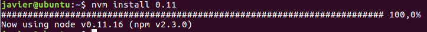

Para poder usar uno simplemente ejecutamos el siguiente comando

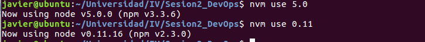

###Desarrollo aplicación "Ranking empresas "

Para el desarrollo se ha usado *express-generator* con la que desplegamos la aplicación *node js*. Dicha aplicación se ha usado en diferentes versiones y **solo funcionaba en la v.5.0**.

A continuación se muestran capturas de la aplicación.

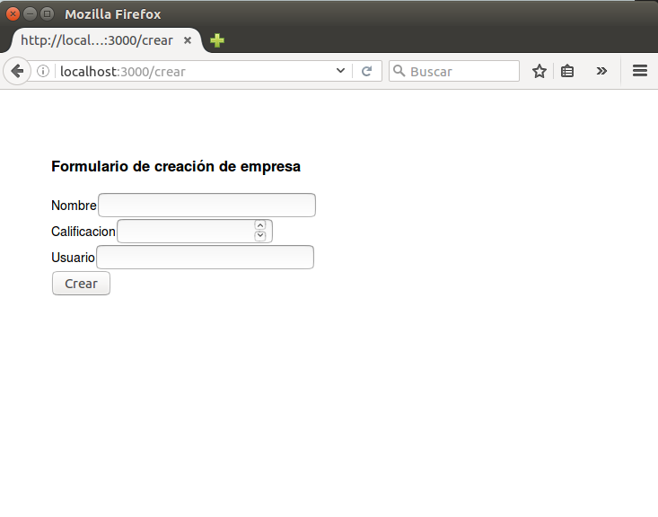

Este programa hace uso de **SQLite3** que se instala con **npm install**. Para que se pueda obtener de forma automática a partir de este momento hay que incluir la dependencia de *sqlite3* en el archivo **package.json**

Para ello usamos la orden de instalar pero añadiendo el parámetro *save*

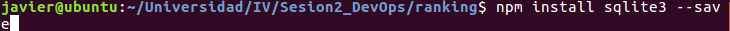

###Creación automática de la documentación de nuestra aplicación

Cuando deseamos tener la documentación de nuestra API en formato html podemos hacer uso de diferentes aplicaciones, que en nuestro caso será **docco** y **grunt-docco**.

El formato que utiliza *docco* es muy simple, la doble barra (//). Para ello se usan como si fueran comentarios en nuestra API, y el programa lo reconoce.

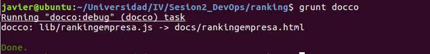

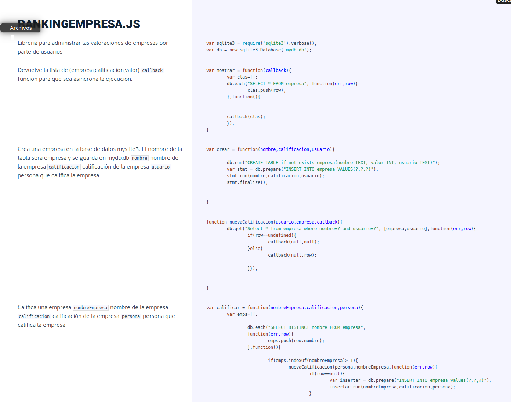

###Desarrollo basado en pruebas 

En este apartado se usa el módulo **assert** para asegurarnos que el resultado de una operación(o conjunto) es lo que esperábamos, y en caso de no serlo que se aborte la ejecución.

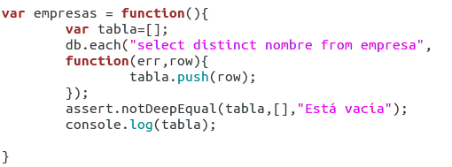;

Comprobamos que falla y cambiamos la configuración.

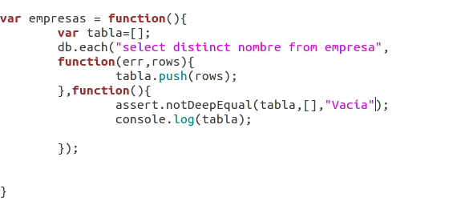;

Para tener un entorno de pruebas a un nivel de abstracción superior podemos usar la librería **mocha**, que hace uso de las directivas a más bajo nivel *assert*. Para ello necesitamos instalar con *npm* la librería, añadiéndola a nuestro archivo *package.json*.

La forma de usarla es *mocha direccion/hasta/el/archivo/test.js* donde test.js contiene nuestro banco de pruebas a realizar a la aplicación. Otra forma es añadiendo a package.json un apartado *scripts*.

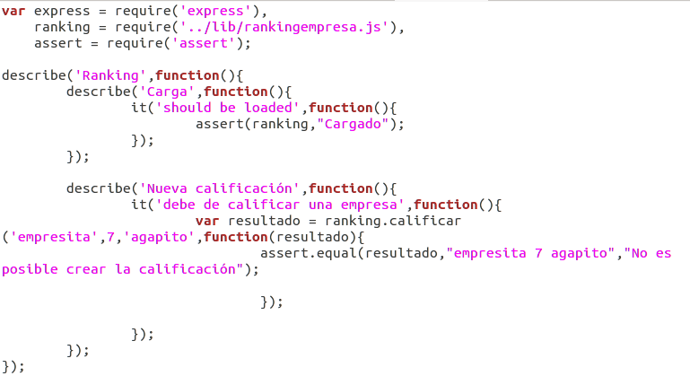

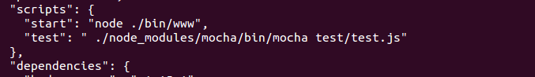

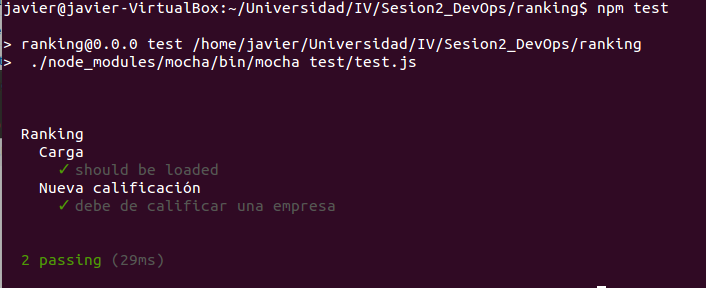

###Añadiendo integración continua

Una forma de probar nuestro programa antes de que se use en producción es mediante **Travis**. Es una plataforma que se sincroniza con la cuenta github y permite añadir tus repositorios para que se ejecuten en máquinas virtuales que le pertenecen. Lo que debe de hacer es tener en el repositorio un archivo de configuarión **.travis.yml** y decir qué debe de hacer. Para ello indicamos el lenguaje de programación usado, la versión que necesita, los pasos para instalar la aplicación con todas las dependencias de librerías y aplicaciones, y finalmente la acción a realizar que serán los tests.

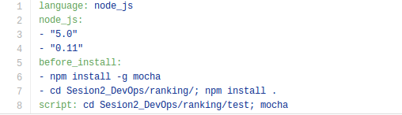

Para la ejecución en este caso decimos que queremos que corra el test que se encuentra en /test de la aplicación. El resultado te lo muestra en la plataforma.

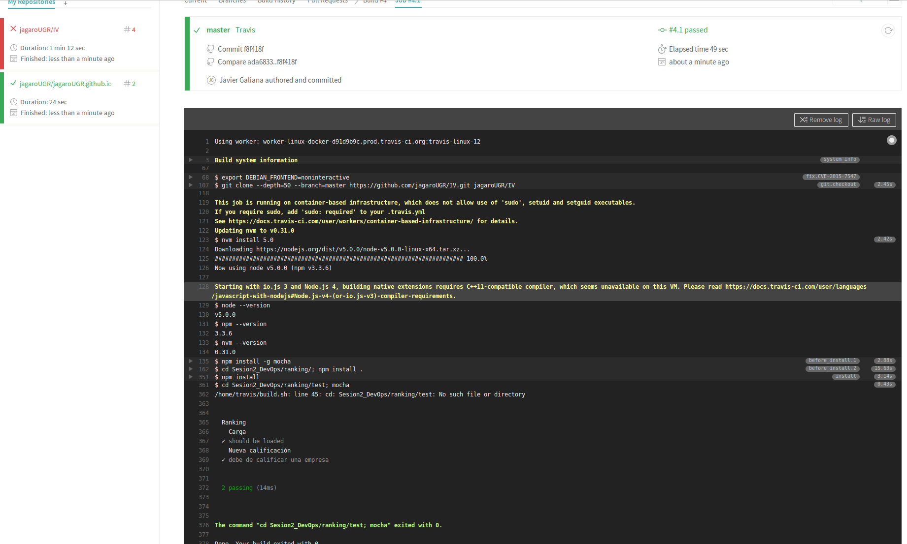

