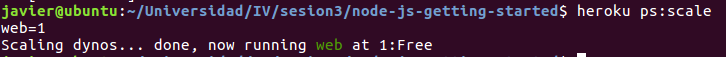
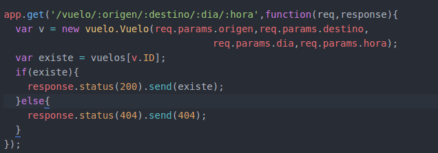

#Creando aplicaciones en la nube: Uso de Paas.

###Ejercicio 1. Instalación de Heroku.

Una vez registrado en su página, la pantalla de inicio es la siguiente

###Ejercicio 2. Creación de una aplicación en Openshift e instalación de wordpress en la aplicación.

###Ejercicio 3. Aplicación en express que usa variables en las órdenes PUT.

Aquí se muestra  un método de la aplicación que permite crear un nuevo vuelo, indicándole el origen, destino,día y hora.

Cuando se prueba el método observamos como se crea una nueva entrada con los datos introducidos, que se almacenan en un array.

###Ejercicio 4. Creación de test unitarios para nuestra aplicación node.js+express.

En este caso desarrollamos un test que prueba la funcionalidad de los métodos de nuestra aplicación. Con estas pruebas buscamos comprobar si el resultado es el esperado.

Para la aplicación desarrollada para esta asignatura, probamos que la creación y recuperación de billetes funciona correctamente. Los tests deben de residir en un directorio dentro de la aplicación llamado **/test**.

Usando *mocha* vemos si nuestra aplicación supera el examen al completo.

que nos muetra que se han pasado todos los tests.

###Ejercicio 5. Despliegue e inicio de una aplicación en Heroku.

La aplicación que se ha usado es la del tutorial de Heroku, donde primero, clonamos el repositorio en nuestro ordenador. Una vez descargado, se accede a la carpeta de la aplicación y se inicia heroku que nos configura la dirección del repositorio remoto de la aplicación para que se pueda subir desde aquí(desplegar) a la cuenta que tenemos en Heroku.

Acto seguido usamos el comando heroku para iniciar la aplicación.

Ahora si nos metemos en la web de la aplicación vemos que nuestra máquina virtual se ha  desplegado y construido(**build**) correctamente.

Para ver la parte que ve el usuario final de la aplicación, es decir, para verlo desde un navegador web, usamos la herramienta *foreman*. Lo que hace es simular el comportamiento de la aplicación como si se estuviera ejecutando en la nube pero de manera local. Para ello se tienen que tener todas las dependencia instaladas.

Ahora desde el navegador podemos ver lo que va a mostrar Heroku cuando le hagan una petición a nuestra aplicación.

###Ejercicio 6. Uso de foreman

La aplicación que se usa es **reservaVuelo** a la cual hay que añadirle solo el Procfile para que Foreman/Heroku sepa que tiene que hacer con la aplicación. Cuando se crea el Procfile se prueba foreman.

###Ejercicio 7. Despliegue en Heroku desde Github usando el servicio de integración continua Snap CI.

1. Debe de haber una entrada en .git/config con el alias de **heroku** que es el que se usa para representar la dirección en heroku de nuestra aplicación, y donde se despliega.

Snap CI nos permite conectar Github con Heroku, siendo el encargado de ante un push a la rama master de la aplicación en Github, hacer pruebas al nuevo contenido y en caso de que se pasen, desplegar las modificaciones en Heroku.

Para ello debemos de darnos de alta en su web y dar permiso a Snap-CI para que acceder a nuestra cuenta de Github. Todo esto se hace de forma guiada de principio a fin, sin nada raro.

Después de darle permiso le decimos el repositorio al que queremos que esté atento.

Así, después de elegir debemos de crear la ruta a seguir, partiendo del repositorio, después pasando las pruebas y finalmente, en caso de que todo haya ido bien, se despliega.

Esto se hace a través de la web de  Snap-CI donde vamos añadiendo bloques de test y despliegue. Hay que tener en cuenta que en despliegue hay que elegir Heroku. Para lo cual se nos pide acceder a nuestra cuenta de usuario desde la web y así poder ellos saber y acceder a las máquinas virtuales que tenemos en Heroku. Una vez se ha conectado con la cuenta de Heroku nos aparecen las aplicaciones que tenemos, y debemos de elegir a que máquina virtual debe de desplegar.

Una vez configurado sólo tenemos que probarlo haciendo un push a rama master de la aplicación y ver el comportamiento de Snap-CI.

Donde vemos que ha pasado los tests y ha podido desplegar las modificaciones.

El siguiente paso es modificar la apliación dándole una nueva habilidad y hacer el test.

Donde vemos que se ha subido correctamente, se ha probado y se han pasado los tests, por lo tanto, ha iniciado el despliegue que también ha sido un éxito.

###Ejercicio 8. Preparar la aplicación para que pueda ejecutarse en un PaaS.

La aplicación que se ha ido desarrollando es la de reserva de vuelos, que ya tenemos preparada. Y cuyo resultado al acceder a la dirección pública es

