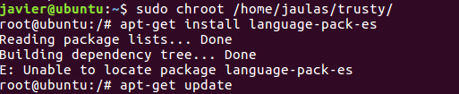
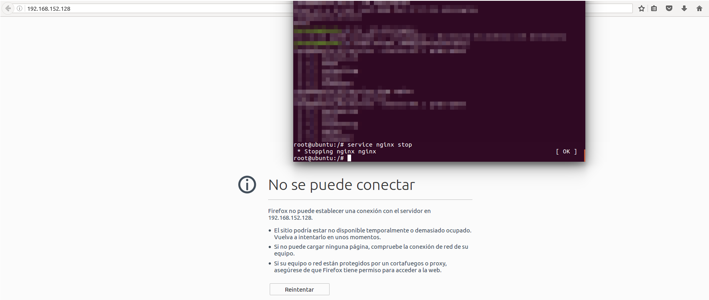
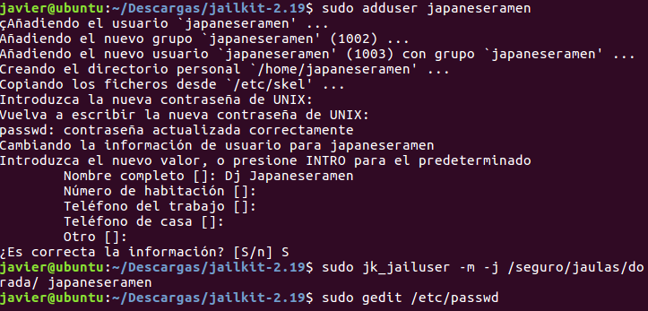

#Técnicas de virtualización.

###Ejercicio 1. Crear un espacio de nombres y montar en él una imagen que no se pueda acceder desde fuera del espacio.

Aquí hemos elegido -m para indicar que el nuevo espacio de nombres es de tipo montaje y por lo tanto se nos permite montar imágenes solo visible por nosotros. En el problema se monta en la carpeta cd, y se comprueba que se puede acceder a los datos así como que aparece la entrada en la tabla /etc/mtab.

###Ejercicio 2. Creación de tarjetas virtuales de Red

####1.Mostrar los puentes configurados en el sistema operativo.

Muestra que tenemos creado un puente llamado **puente** y al que se le ha asignado la interfaz ens33. Este puente puede ser usado por las máquinas virtuales de forma que harán peticiones al puente, y el las remitirá a alguna de las interfaces. La respuesta es al sentido inverso.

####2. Creación de un puente y asignación de una interfaz.

1. Creamos el puente con **sudo brctl addbr <nombre>**.

2. Asignamos una interfaz al nuevo puente **sudo brctl addif <nombrePuente> <nombreInterfaz**. Ahora la máquina se comunica con el puente que se comunica con la interfaz.

###Ejercicio 3.
####1.Uso de debootstrap para crear una jaula **debianita**.

Primero creamos la carpeta que contendrá al sistema, la jaula. y después usamos el comando debootstrap para instalar ubuntu trusty.

####2.Uso de Rinse para crear una jaula Fedora.

La imagen es CentOs-5.

###Ejercicio 4. Configuración de una jaula que contiene un sistema de tipo debian por medio de chroot.

Aquí entramos en nuestra jaula creada por **debootstrap** y establecemos desde la máquina anfitriona un **enlace** entre el sistema de ficheros /proc con el sistema de ficheros /proc de la jaula. Además se le copian los archivos **/etc/resolv.conf**, que sirve para conocer que la jaula pueda comunicarse con los dns y tener acceso a internet, y **/etc/apt/sources.list** que es la lista de repositorio de ubuntu usados por la herramienta **apt-get**

Ahora podemos usar internet en nuestra jaula y usar los repositorios de ubuntu.

###Ejercicio 5. Instalación del servidor nginx en una jaula y su puesta en marcha.

Instalamos nginx en nuestra jaula, y vemos que no está instalado en la máquina anfitriona. Esto lo hacemos para que al final podamos ver desde la máquina anfitriona y a través del navegador que el servidor nginx del invitado es accesible.

Nos conectamos a la jaula y vemos que el servicio no está en ejecución y por eso el navegador de la máquina anfitriona no encuentra lo que se pide.

En este momento ponemos en marcha el servidor, y comprobamos que en la web sí aparece la página de bienvenida de **Nginx**

Finalmente comprobamos que no tenemos el servidor nginx en la máquina anfitriona.

###Ejercicio 6. Crear una jaula y enjaular un usuario con **jailkit**

1. Se crea la jaula con el comando **jk_init** que nos instala en la jaula las herramientas que especificamos por sus alias, los alias nos identifican regiones del archivo de configuraciom

2. Creamos un usuario en la máquina anfitriona al que enjaulamos con el comando **sudo jk_jailuser**. Para poder conectarse con ssh a la jaula debemos de editar en **/etc/passwd** la entrada del nuevo usuario, cambiando su **shell** por defecto a **/bin/bash**

Comprobamos que ahora esté correcta la entrada del nuevo usuario.

Para finalizar, nos conectamos por ssh como el usuario enjaulado y comprobamos cual es su posición actual en el sistema de ficheros. El resultado es el mismo que cuando creamos un usuario que queremos que cuando se conecte se conecte directamente a la jaula.
