#Ejercicios Contenedores

##Ejercicio 1. Instalación de lxc

Primero de todo necesitamos instalar lxc y comprobar que funciona con nuestro
hardware.

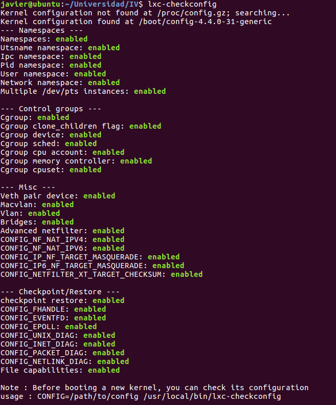

Ahora podemos empezar a crear contenedores. Las *plantillas* que podemos usar se encuentran
en */usr/share/lxc/templates*.

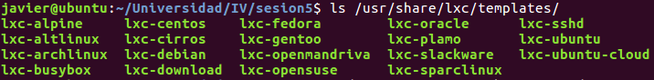

##Ejercicio2. Instalación de un contenedor.

En este caso, se crea un contenedor con una imagen de cloud server de Ubuntu, a la que denominamos cloudUbuntu.

Una vez instalado, lo iniciamos y comprobamos el estado.

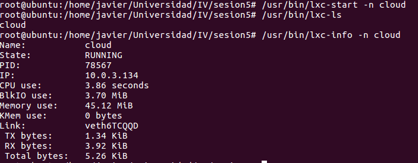

Seguidamente vemos que se crea una interfaz y un puente de red, que hace uso de la nueva interfaz, para el contenedor.

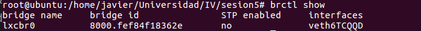

Se puede observar que el nombre del puente es **lxcbr0**, mientras que la interfaz de red es **veth6TCQQD**. Los puentes(*briges*) son creados como un dispositivo que conecta diferentes interfaces de red en una sola, así la persona que usa este conjunto lo verá como si fuera solo una, es decir, solo verá el puente, que actúa como enrutador hacia/desde las interfaces conectadas.

A continuación, se muestran las entradas correspondientes al comando ifconfig

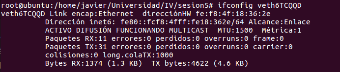

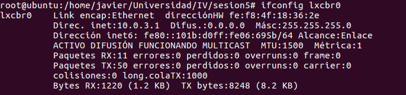

##Ejercicio 3.Instalación de contenedores que corren distintas distros.

1. En este caso usamos el contenedor con la imagen cloud y nos conectamos a él después de iniciarlo, mediante la orden *sudo lxc-attach -n <nombre>*

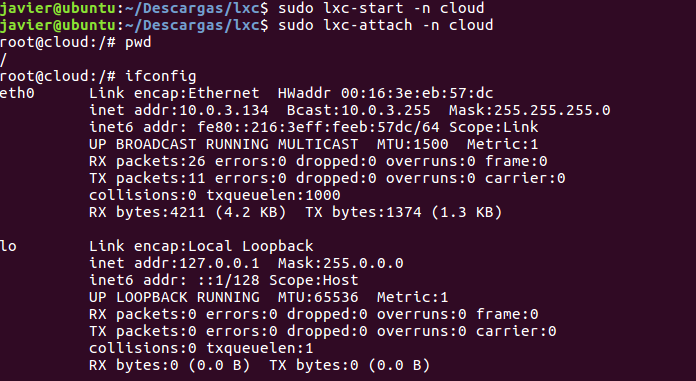

2.En ubuntu 16.04 creamos un contenedor con una distribución de Fedora

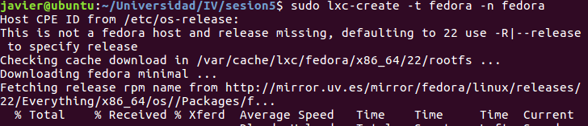

Ahora podemos arrancarla y conectarnos

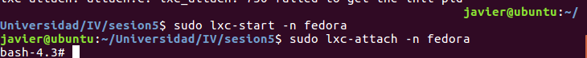

##Ejercicio 4. Gestión de los *tapers* usando lxc-webpanel.

1.Instalamos en la máquina anfitriona el programa *lxc-webpanel*

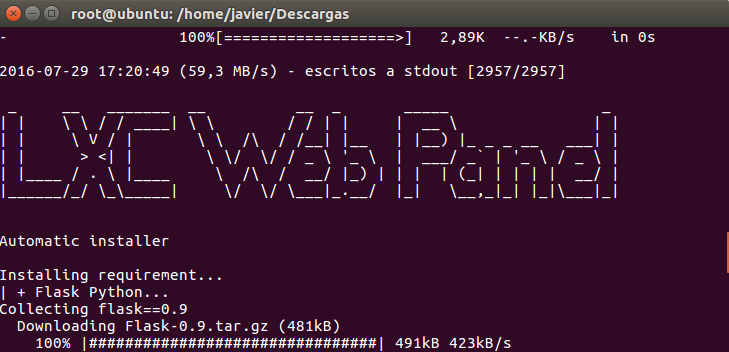

Una vez instalado provamos que el servicio(daemon) está corriendo.

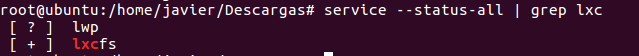

Ahora accedemos desde nuestro navegador web a la página que nos permite gestionar nuestros *tapers*, cuya dirección es, como es lógico, localhost:5000, ya que es un servicio que se está ejecutando en nuestra máquina. En este caso el servicio usa el puerto 5000.

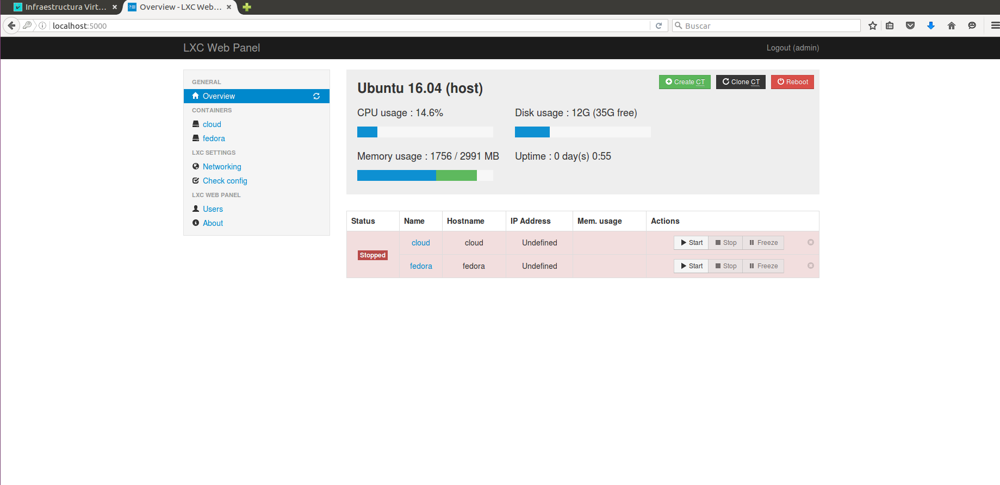

Como se puede apreciar los tapers se encuentran parados. Para que comiencen a ejecutar sólo debemos de pulsar el botón start del taper que deseemos. Haciendo que se inicie

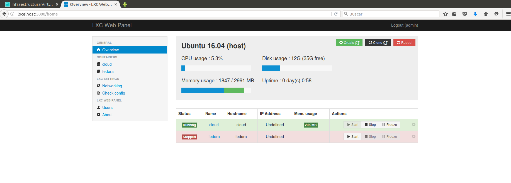

Para ver como está configurada la máquina pulsamos en el panel lateral, en la sección *containers*, la máquina que deseemos. Esta acción nos presenta los parámetros del taper que podemos configurar.

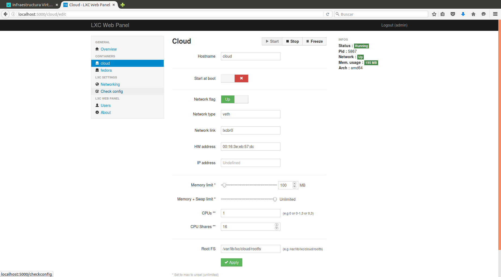

2. En este apartado se cambian las especificaciones de las máquinas, es decir, restringimos los recursos asociados para cada una, siguiendo los pasos del apartado anterior.

Por ejemplo, accedemos a las especificaciones del *taper* cloud, y restringimos su memoria RAM máxima para que solo pueda usar 20MB.

Acto seguido, la arrancamos y vemos el uso de Memoria que hace, que en este caso es de 19MB.

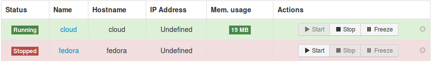

##Ejercicio 5.Comparación de prestaciones del uso del servidor de altas prestaciones nginx en una jaula y en un contenedor.

En este caso se muestra el uso de recursos que hace el servidor nginx en nuestro taper *cloud*

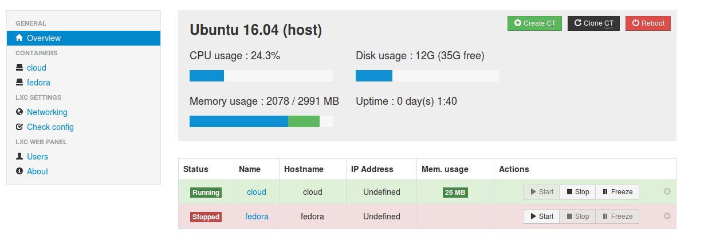

Claramente solo hace uso de 26MB de RAM y si lo comparamos cuando está parado

vemos que el taper que sería el servidor sólo hacía uso de un 0'6% de CPU.

##Ejercicio 6. Instalación del gestor de contenedores *docker*

Para instalarlo desde Ubuntu 16.04 usamos el repositorio de paquetes

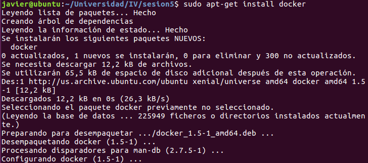

Además hace falta instalar otro paquete

Y a partir de ahora podemos usar el gestor de contenedores docker haciendo la prueba que te indican en el tutorial de primeros pasos que ofrece docker.

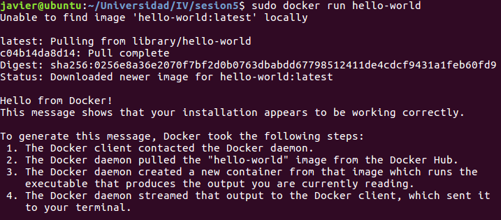

Para comprobar que funciona correctamente usamos la orden *sudo docker ps -a*, que nos muestra las máquinas que tenemos instaladas localmente y donde debe de aparecer la imagen *hello-world*.

##Ejercicio 7. Instalación de imágenes con docker.

1. Para buscar imágenes que en tengan un determinado sistema operativo o imágenes con entornos determinados usamos la orden *search* de docker, que por ejemplo para buscar una imagen del sistema operativo Centos 

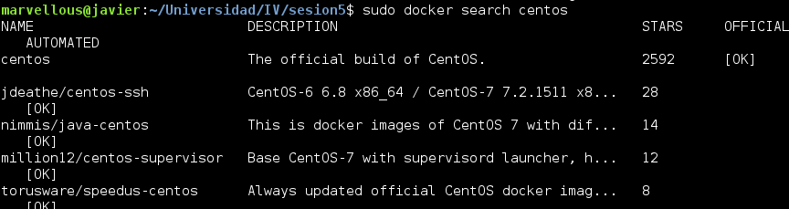

Y para hacer correr alguna se hace como sigue

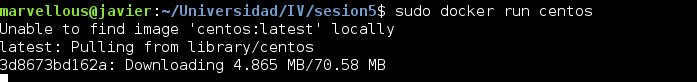

lo que hace que tenga que descargarse primero ya que no forma parte de las imágenes locales.

Ahora hacemos lo mismo para una imagen de ubuntu

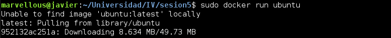

2. Ahora lo que queremos es una imagen que tenga mongodb instalado, para ello realizamos la búsqueda en el repositorio de imágenes de docker y la lanzamos como sigue

Finalmente podemos ver las imágenes que nos acabamos de descargar formar parte de nuestro entorno Dockers

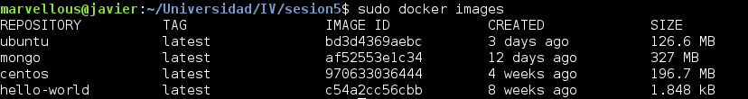

##Ejercicio 8. Acceso y utilización de contenedores

La forma de acceder es la siguiente

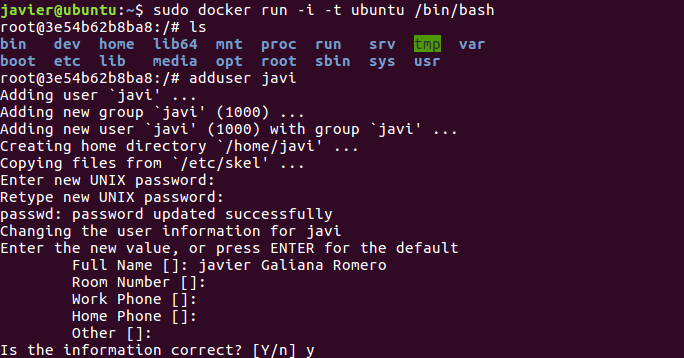

Con esto creamos un contenedor donde corremos la imagen que tenemos descargada, si no la descarga, y con la opción -t se crea un pseudo-terminal que acompañado de -i hace que el descriptor STDIN esté abierto, permitiendo interactuar con el contenedor a partir de la terminal. El resultado es que la terminal se vuelve en una terminal del contenedor y todos los comandos que ejecutemos son sobre el contenedor creado. En este caso se ha creado un usuario **javi** con el que podemos acceder desde este momento con la orden **su javi**

Lo siguiente es instalar alguna aplicación, en este caso es nginx, el cual hacemos correr.

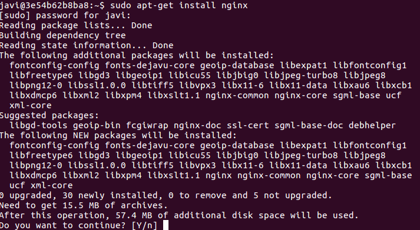

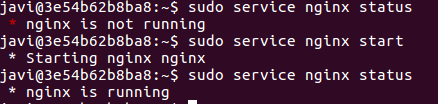

##Ejercicio 9. Guardar los cambios de un contenedor en forma de nueva imagen.

Cuando hemos estado usando una imagen, instalando programas, configurándolos, etc... no queremos que se nos pierda o bien poder exportarlo a otro sistema y para ello debemos de hacer un commit de nuestro contenedor lo que nos creará una imagen nueva como las que nos hemos instalado al inicio.

Primero se tienen que listar los contenedores que tenemos ejecutando, esto se hace con la orden **ps -a** de docker. Después localizar el id sin truncar del contenedor que queremos transformar en una imagen y ahora podemos hacer commit usando las opciones como -m, mensaje que describe la imagen, -a, el autor.

Para hacerlo más correcto debemos de indicar después del identificador el nombre del repositorio y de la etiqueta con el formato nombre:etiqueta. Esto se muestra en la siguiente imagen, donde al hacer el commit mostramos las imágenes que forman parte de nuestro entorno Docker, y viendo que la primera entrada es la nueva imagen.

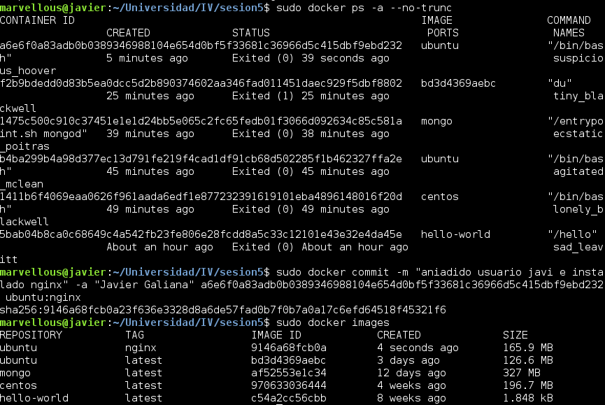

##Ejercicio 10. Creación de una imagen imagen para la ejecución de una aplicación node.js

Siguiendo el tutorial de [crear una imagen de docker para correr una aplicación en node.js](https://hub.docker.com/_/node/).

1. Creamos el archivo DockerFile en el directorio de la app

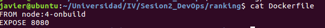

2. Creamos la imagen a partir del Dockerfile. El nombre de la imagen se indica con el argumento -t.

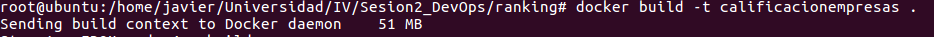

3.Ejecutamos la imagen que nos proporcionará un contenedor.

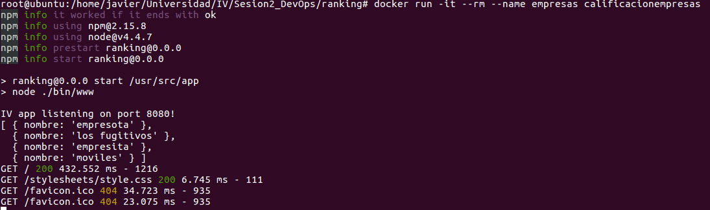

4.Ahora necesitamos conocer la ip que está usando para poder conectarnos desde un navegador web.

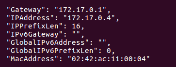

Ahora ya podemos ver la app en el navegador

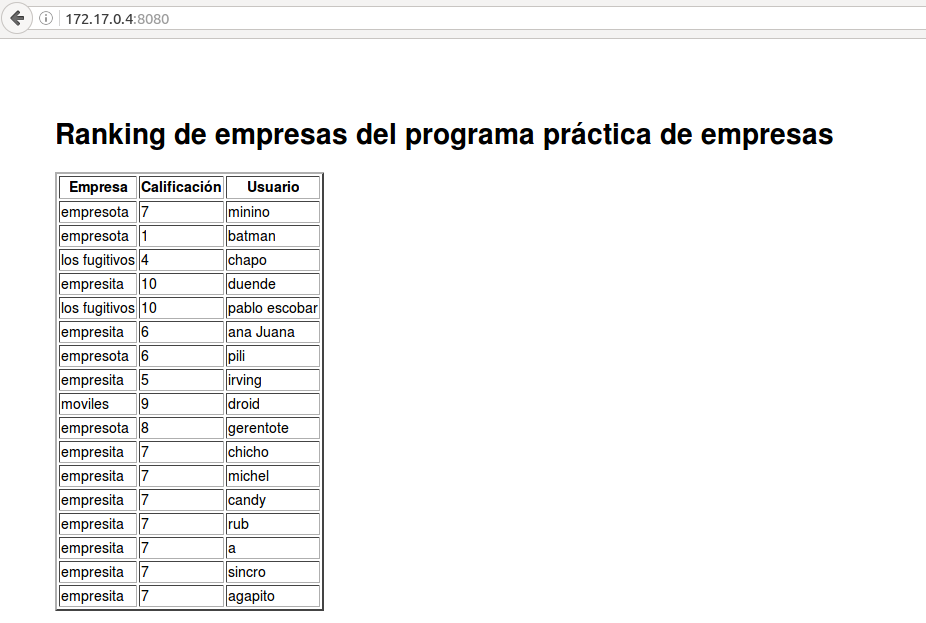
