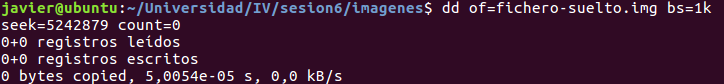
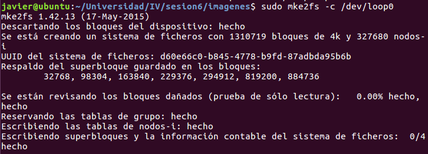
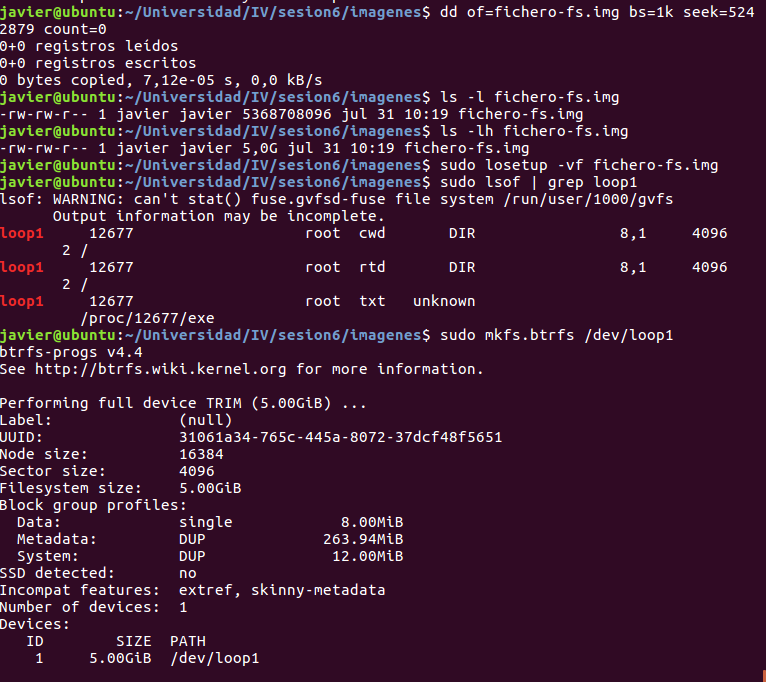
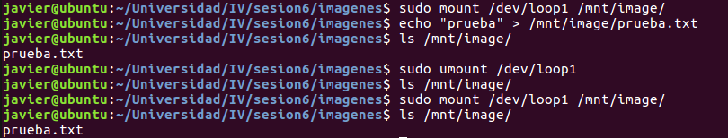
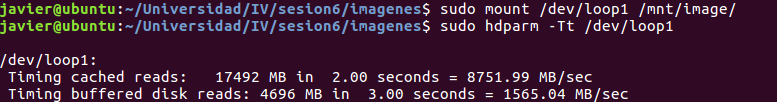
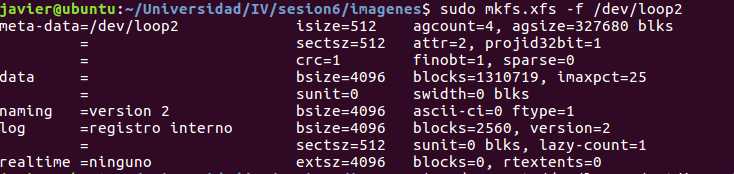
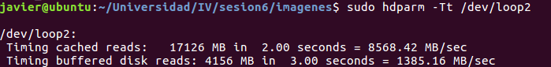
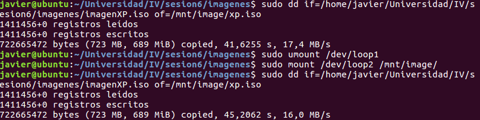
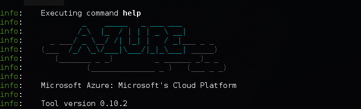
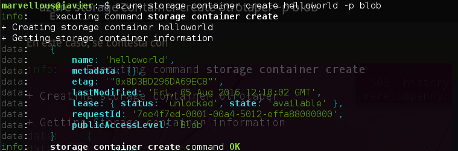

#Virtualización del almacenamiento

##Ejercicio 2. Uso de FUSE para acceder a recursos remotos

Con este ejercicio se ha accedido a un portátil mac desde ubuntu a través de un sistema de ficheros virtual, que nos permite montar un sistema de ficheros remoto en nuestra jerarquía, permitiendo acceder igual que cualquier carpeta del sistema.

##Ejercicio 3. Creación y manipulación de imágenes.

La forma de crear dispositivos de almacenamiento es la siguiente:

1. Creamos una imagen que contendrá los datos, es decir, es el espacio físico.

2. Le asignamos un driver para que pueda ser reconocido por el sistema. En nuestro caso es el dispositivo /dev/loop

3. Formateamos el dispositivo /dev/loop que se nos haya asignado para la imagen, con el formato que deseemos. En este caso el sistema de archivos será de tipo **brtfs**.

A partir de aquí podemos usarlo montándolo en el sistema de archivos de nuestro sistema

Para comprobar el funcionamiento lo montamos y creamos un fichero en nuestro nuevo sistema de archivos. Después lo desmontamos comprobando que ya no se puede acceder. Finalmente, se vuelve a montar comprobando que sigue el archivo que habíamos creado anteriormente.

##Ejercicio 4. Creación de sistemas de fichero btrfs y xfs. Comparación de prestaciones.

La forma de crear los sistemas de ficheros *brtfs* es como se ha visto en el ejercicio anterior. Una vez que tenemos el dispositivo /dev/loop0 montado hacemos una prueba de lectura.

Ahora toca crear otro sistema de ficheros pero de extensión **xfs**. Al igual que en el ejercicio anterior creamos el fichero que contendrá los datos y lo asociamos a un dispositivo /dev/loop. Finalmente lo formateamos para que se use como sistema de archivos de tipo *xfs*. 

Ahora podemos montarlo y hacer pruebas de lectura sobre el sistema de archivos.

Finalmente, hacemos una prueba de lectura para ambos sistemas de archivos

##Ejercicio 8. Instalación de la interfaz de línea de órdenes para Azure.

A.Instalación

1.Crear cuenta en Azure
2.Instalar paquete npm de azure de forma global
	sudo npm install azure-cli -g
3.Si aparece un error que no existe /usr/bin/env:node crear un enlace simbólico
	sudo ln -s /usr/bin/nodejs /usr/bin/node
4.Probar con azure help
5.Conectarse a una cuenta de Azure
	azure login
Cuando se conecta por primera vez te pide que ingreses en una web e insertes un código de validación que te proporciana el comando.
6.A partir de este momento se encuentran los datos de la cuenta guardados en la carpeta ~/.azure
7.Para cerrar la sesión usar azure logout

Al ejecutar azure nos muestra por pantalla  una pantalla de inicio.

##Ejercicio 9. Creación de contenedores y almacenamiento.

B.Creación de contenedores

1. Crear una cuenta de almacenamiento con un nombre que se desee
	azure storage account create jagaro
Elegir el tipo de replicación que por defecto es RAGRS y la zona del servidor donde se almacenará la información.

2. Obtener las claves primaria y secundaria del servidor
	azure storage account key list jagaro
y copiarlas en el archivo ~/.profile como 
	AZURE_STORAGE_ACCOUNT=nombreCuenta
	AZURE_STORAGE_ACCESS_KEY=primary
y al haberlas incluido por primera vez recargar el archivo .profile con
	. ~/.profile

3. Ahora empezamos a crear contenedores con
	azure storage container create helloworld -p blob

4.En este momento podemos subir archivos a nuestro contenedor con el comando
	azure storage blob upload blobHelloWorld.png helloworld helloworld.png
donde el primer argumento es el fichero a subir, el segundo el contenedor donde se almacena el blob y finalmente el nombre que queremos asignar al blob dentro del contenedor.

5.Crear guiones ruby para manejar contenedores.

