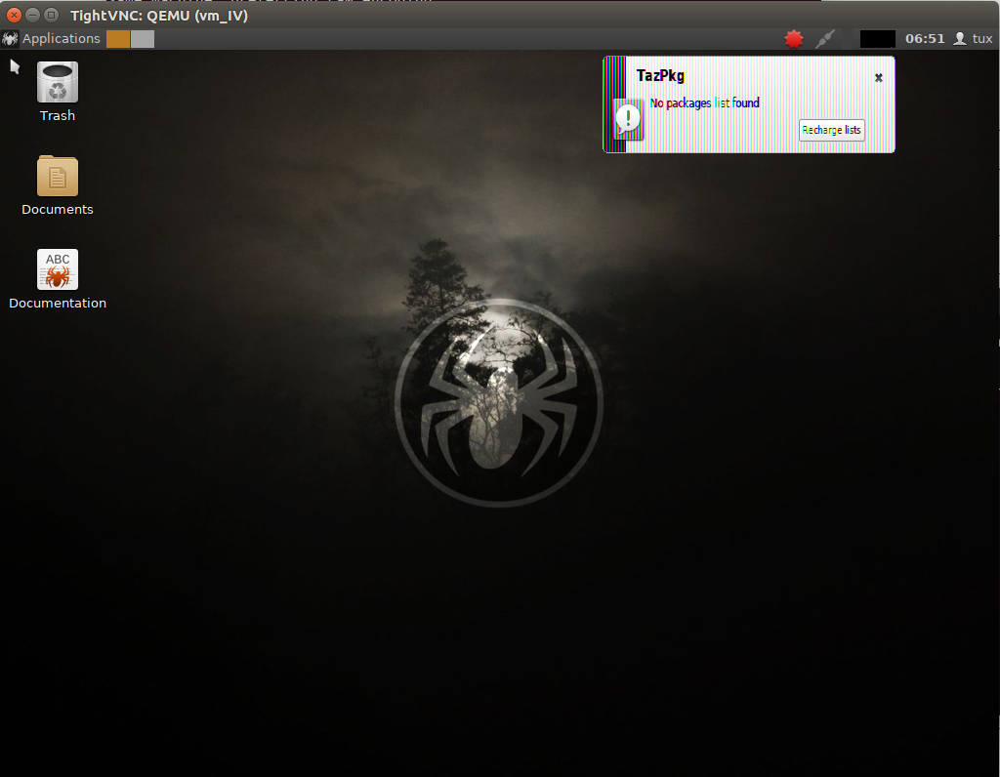

#Virtualización completa: uso de máquinas virtuales

##Ejercicio 1. Instalación de los paquetes necesarios para usar el hipervisor KVM.

##Ejercicio 2.Creación de máquinas usando hipervisores
1. Usando KVM

Lo primero es que tenemos que tener un disco duro virtual con formato *QCOW2*. Después instalamos debian de la siguiente manera.

El parámetro -hda indica el disco virtual donde queremos instalar el SO y con -disc indicamos la imagen del SO que queremos correr.

Por defecto, en pc's nuevos tenemos que la memoria que otorga a la máquina invitada es de 128M por lo que para coreOS es insuficiente. Para indicar la cantidad de memoria que queremos usar es con el parámetro -m.

Como se muestra, se pueden instalar SO's distintos, como por ejemplo, *minino*.

2. Usando XEN

En esta parte usamos el hipervisor XEN. Para ello necesitamos crear un **grupo volumen** y dentro un **volumen lógico**. A partir de ahí necesitamos crear un archivo de configuración donde especifiquemos las características de la máquina, CPUs, RAM, discos lógicos,...

Para crear la instancia usamos **sudo xl create archivo.cfg** y después por vnc, nos conectamos con **vncviewer localhost:0**

##Ejercicio 4. Creación de una máquina virtual Linux con 512M de RAM con entorno gráfico LXDE, al que se pueda acceder por VNC y ssh.

En este apartado usamos el hipervisor XEN para crear nuestra mñaquina y nos conectamos a ella por medio de vncviewer.

El sistema operativo instalado es lubuntu.

##Ejercicio 5. Creación de una máquina virtual con Azure

1. Ver las máquinas virtuales disponibles en Azure

  azure vm image list

2. Crear una máquina virtual

  azure vm create nombredetuvm nombreimagen user password --location=lugarservidor -ssh

donde nombredetuvm es el identificador único que será de tu máquina, nombre en minusculas, mientras que nombreimagen es el nombre de la imagen hospedada en azure así como user y password son los credenciales para acceder a la misma. Finalmente, se elige ssh para el modo de acceso a la misma.

3. Hacemos azure vm list que nos muestra nuestras máquinas así como el nombre de la dirección donde está nuestra vm.

4. Usamos el user y nombre de la dirección del apartado anterior para acceder usando ssh.

5. Instalamos,probamos,lo que queramos. Por ejemplo,

	sudo apt-get install nginx

nos permite instalar el servidor nginx en nuestra máquina ubuntu.

6. Cuando dejemos de usarla la apagamos con

	azure vm shutdown nombredetuvm

##Ejercicio 6. Uso de Juju para gestionar máquinas alojadas en Azure.

Usando los pasos que se indican en la web se logra llegar hasta este punto del cual no se pasa.

##Ejercicio 7. Instalación de una máquina virtual con virt-install.

La herramienta permite crear VM para distintos hipervisores, entre los que están qemu, xen,lxc, creándote además el disco virtual, si lo quieres, así como elegir la configuración que desees.

En este caso, se ha elegido instalar Linux Mint sobre una máquina virtual de tipo **qemu** especificando que queremos que cree el disco virtual y su tamaño de 15G. Además se le indica la memoria RAM y el nombre.

muestra la máquina virtual emulada por **virt-install**. Donde elegimos la opción de instalar y cuando finaliza decimos que reinicie y ya tenemos una máquina que usa el hipervisor **qemu**.

