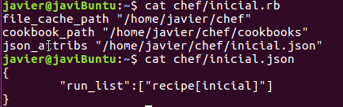

#Gestión de infraestructuras virtuales.

###Ejercicio 1. Instalar chef en una máquina virtual.

Instalamos chef en ubuntu mediante

	sudo apt-get install ruby2.3 ruby2.3-dev

	sudo gem install ohai chef

###Ejercicio 2. Creación de una receta de chef con diversas tareas.

Creamos el directorio /home/javier/chef/cookbooks/inicial/recipes que es donde se almacena el script inicial para instalar

* nginx
* tilda
* la carpeta ~/Universidad/IV y el fichero README.md dentro de ella

1. Se crea el archivo ~/chef/cookbooks/inicial/recipes/default.rb

2. Se crea ~/chef/inicial.json y ~/chef/inicial.rb

4. Ahora ejecutamos

	sudo chef-solo -c ~/chef/inicial.rb

y comprobamos el resultado

###Ejercicio 3.Escritura en YAML de estructura de datos en json

###Ejercicio 4. Despliegue de aplicación ubicada en un servidor Git público en una máquina creada en Azure.

Para desplegar los fuentes de una aplicación alojada en git debemos de

#Ejercicio 5. Despliegue de una aplicación propia con Ansible.

Creamos un fichero con extensión .yml

que desplegará en la máquina alojada en Azure la aplicación reservaVuelo, que se encuentra en el repositorio git jagaroUGR/reservaVuelo.git.

Lo siguiente es lanzar ansible-playbook que se encarga de la gestión del despliegue

Y finalmente comprobamos que funciona el programa en la máquina virtual.

###Ejercicio 6. Instalación de una máquina virtual Debian usando Vagrant.

Para usar vagrant primero debemos de instalarlo en nuestra distribución ubuntu

	sudo apt-get install vagrant

A partir de ahí tenemos que usar

Cuando la instalamos nos conectamos por medio de

###Ejercicio 7. Instalación de un servidor Web usando Vagrant.

La forma de provisionar en Vagrant es a través del archivo Vagrantfile que usamos cuando queremos encender nuestra vm. Escibiendo con formato Ruby en ella podemos ejecutar nuestras operaciones de provisionamiento

###Ejercicio 8. Configuración de una máquina virtual usando Vagrant y el provisionador Ansible.

Finalmente podemos configurar la máquina vagrant utilizando también Ansible.

En este caso hemos usado el guión de Azure cambiando *hosts* a all y así ya ha sido posible configurar nuestra vm con la aplicación anterior. Una vez tenemos el archivo de provisionamiento configuramos el Vagrantfile

El caso es que esta máquina no tiene instalado el módulo git y por tanto debemos de incluirlo en la lista de paquetes a instalar.

Hacemos vagrant provision y vemos que ha salido bien la operación.

